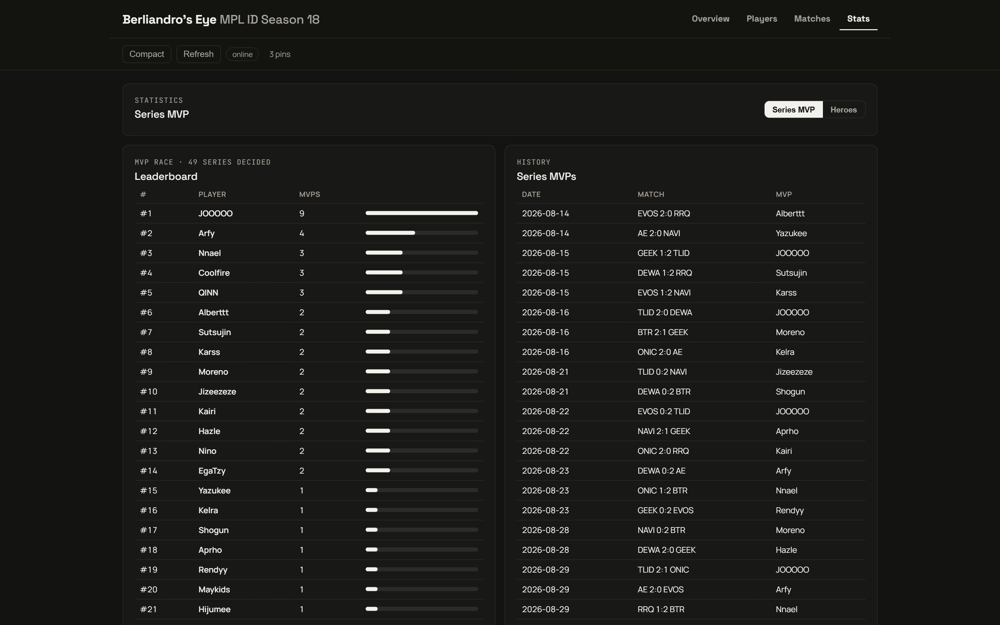
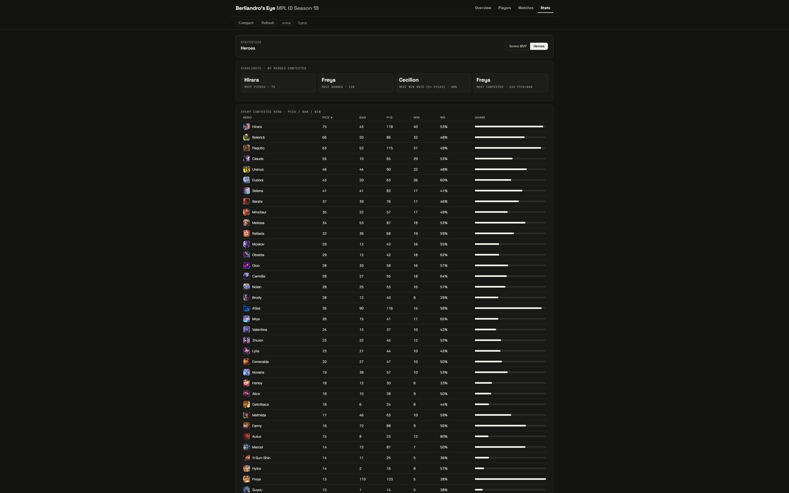

# Berliandro's Eye - MPL ID Season 18

A dark, minimalist, frosted-glass web app for exploring **MPL Indonesia Season 18**
(regular season + playoffs): player stats, match scoreboards, standings, and series MVPs.
Ships as a **single self-contained HTML file** (`mpl_id_s18_dark.html`) with all data
and hero/item artwork embedded — it works offline from the snapshot and refreshes
live from the mlbbhub API when online.

## Screenshots

### Overview — player deep dive (KDA trend, hero pool, win rates, items, game log)


### Players — sortable cards with hero pools


### Matches — full-width list layout with series MVP per match


### Matches — grid layout with series MVP per card


### Scoreboard — symmetrical 50/50 split, per-game MVP, first-pick glow


### Player card — per-hero AVG KDA / K / D / A, MANIAC, SAVAGE (🚧 under development)


### Stats — Series MVP race leaderboard + history


### Stats — Heroes dashboard (highlights + sortable pick/ban/win table)


## Features

- **Overview** — pick any player: tiles (games, avg KDA, game/match W-L + WR, avg game
  time, kill participation), KDA-trend chart, hero pool with win rates, side splits,
  top items, emblems & talents, record by opponent, series MVPs, full game log.
- **Players** — grid/list cards with photos, KDA, GPM, hero pools; filter by team,
  lane, search text; sort by KDA / games / kills.
- **Matches** — full-width frosted list (date, logos, score, status, series MVP) and
  grid cards (also showing series MVP). A Regular/Playoffs sub-tab switches phases.
  Regular phase shows the **standings board** on top; Playoffs shows **final
  positions** plus a **bracket preview** (Round 1 → Grand Final) under the history.
  Completed cards open the scoreboard.
- **Scoreboard dialog** — symmetrical 50/50 team split with first-pick blue/red glow,
  centered header (score, duration, date), full-width bans bridge, mirrored player
  rows, and a **per-game MVP pill** next to “TEAM won”.
- **Player dialog** — per-hero table: GP, AVG KDA (`00.00`), AVG K, AVG D, AVG A,
  MANIAC, SAVAGE, GPM.
- **Stats** — sub-tabbed dashboard: **Series MVP** (race leaderboard + history) and
  **Heroes** (highlight tiles + sortable pick/ban/win table with share bars).
  Every statistic column sorts ascending/descending with a minimalist ▲▼ indicator.
  MVP names from Liquipedia are normalized to one canonical player identity
  (e.g. Coolfire → Joshuaa, JOOOOO → Kevinn, Sutsujin → Arthur — see
  `PLAYER_ALIAS` in `tools/templates/app.js`), so aliases aggregate instead of
  splitting into phantom players; the source spelling is kept as an “as …” note.
  Every hero opens a drill-down modal (picks/bans/WR tiles, most-used
  items/emblems/talents, players with counts, and a game list with
  `DATE | MATCH | GAME | TYPE | RESULT` columns that opens the exact game);
  PICK rows show the hero's team result as Win/Loss while BAN rows stay neutral,
  and assets drill further into global usage.
- **Offline-first** — embedded snapshot renders instantly; Refresh re-fetches live
  data with retry/timeout, caches to `localStorage`, and reports how many brand-new
  heroes/items were served from the live CDN.

## Stat notes (how derived numbers work)

- **Game MVP**: the mlbbhub API exposes no per-game MVP (game `summary` is empty), so
  the app awards it to the **highest-KDA player on the winning team**
  (tiebreaks: kills, then gold). Series MVP comes from Liquipedia.
- **MANIAC / SAVAGE**: 🚧 **Under development** — no API endpoint (`/match`,
  `/stats/players`, `/stats/heroes`) or official MPL ID page publishes kill-streak
  data (the official leaderboard exists for MPL MY only), so these columns render
  `–` until a source exists. They are never fabricated.

## Project layout

| Path | What it is |
|---|---|
| `mpl_id_s18_dark.html` | Built app (generated — open this in a browser) |
| `tools/templates/` | Single source: `doc.html`, `style.css`, `app.js` |
| `tools/build_s18_db.py` | ETL: mlbbhub + Liquipedia → SQLite + `data/csv/` |
| `tools/gen_dark.py` | Build: CSV + assets → `mpl_id_s18_dark.html` |
| `tools/fetch_assets.py` | Download every referenced hero/item asset (`--check-only`, `--live`) |
| `tools/check.py` | Regression suite (incl. STRICT asset coverage + JS syntax gate) |
| `tools/verify.py` | Standard verification: all unit suites + `check.py` + parity gate |
| `tools/test_chances.js` | Probability-engine tests (node) |
| `tools/test_refresh.js` | Live-refresh merge tests (node) |
| `tools/test_cache.js` | Cache versioning tests (node) |
| `tools/test_config.js` | Season-config tests (node) |
| `tools/test_liqparse.py` | Liquipedia parser + ETL gate tests |
| `tools/test_config.py` | Season-config schema tests |
| `data/season.json` | Validated season rules (teams, slots, priors, endpoints, cache) |
| `tools/check_parity.py` | Regen parity gate |
| `tools/shots.py` | README screenshots per the shooting spec below (Playwright + system Chrome) |
| `assets/` | Downloaded artwork + `manifest.json` |
| `data/` | SQLite DB, CSV exports, `lanes.json` |
| `github/assets/` | README screenshots |

## Commands

```bash
python tools/build_s18_db.py   # full ETL rebuild (network)
python tools/fetch_assets.py   # download missing hero/item assets
python tools/fetch_assets.py --live        # also cover season progress
python tools/fetch_assets.py --check-only  # audit only
python tools/gen_dark.py       # rebuild the HTML
python tools/verify.py         # standard regression: unit suites + check.py + parity
python tools/check.py          # data-integrity + asset suite alone (0 failures expected)
node tools/test_chances.js     # probability-engine tests alone
python tools/shots.py --zoom # re-capture README screenshots (see spec)
```

GitHub Actions (`.github/workflows/ci.yml`) runs the build plus
`tools/verify.py` on pushes to `main` and pull requests targeting `main`.
CI uses only committed data and templates — the network ETL and the
Playwright screenshots are manual steps, not CI jobs.

## Screenshot spec (do not change without approval)

- Canvas: **2880×1800 PNG** exact (asserted from the PNG header after capture)
- System zoom **150%** (viewport 1920×1200 CSS @ device scale factor 1.5) +
  website zoom **125%** (body CSS zoom) = zoomed-in, high-resolution look
- Every shot waits for webfonts and all in-viewport images to finish loading —
  no fixed sleeps — so photos and icons are never captured half-loaded

Serve locally (or just double-click the HTML):

```bash
python -m http.server 8931
# → http://localhost:8931/mpl_id_s18_dark.html
```

## Data sources

- Matches, games, per-player stats, drafts: `https://mpl.mlbbhub.com/api/v1/id`
- Series MVPs, schedule cross-check: Liquipedia (`MPL/Indonesia/Season 18`)
- Hero artwork: scoregg CDN, Liquipedia infoboxes (see `tools/fetch_assets.py`)
