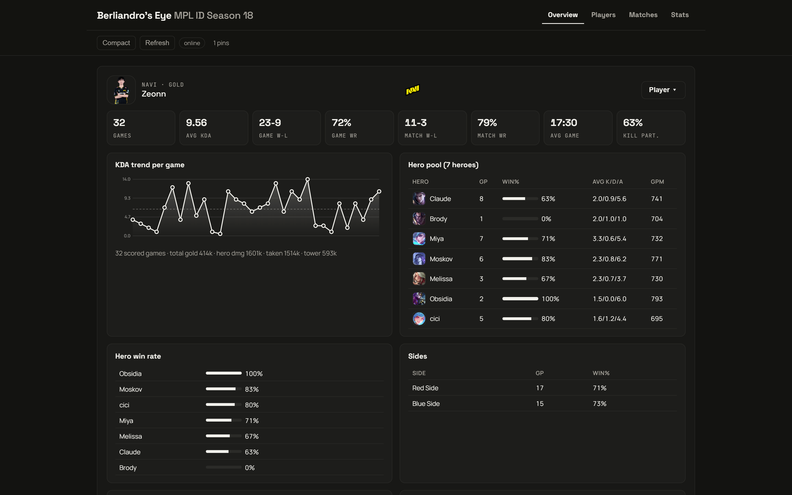
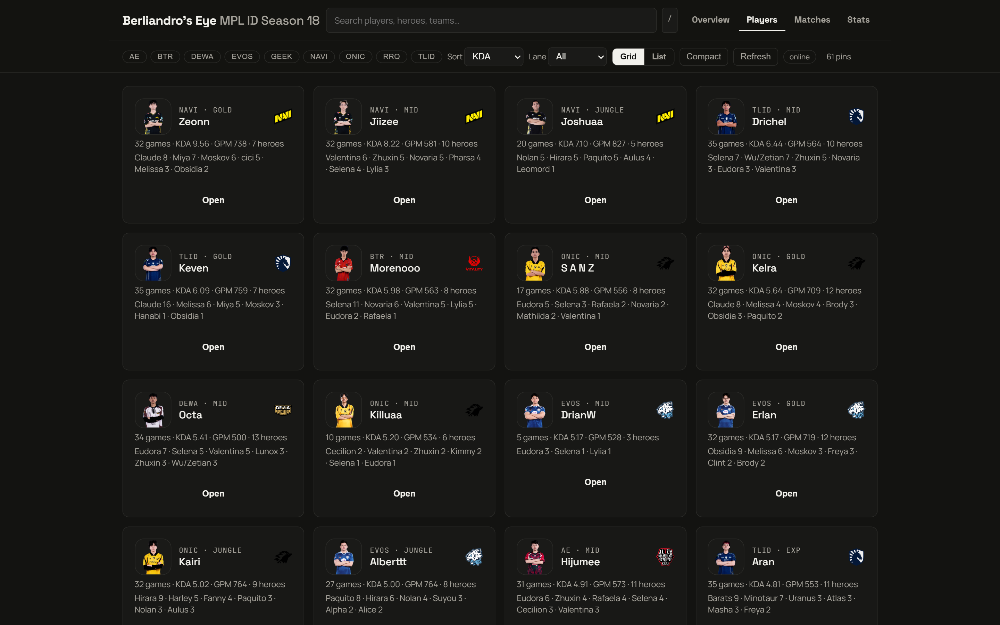
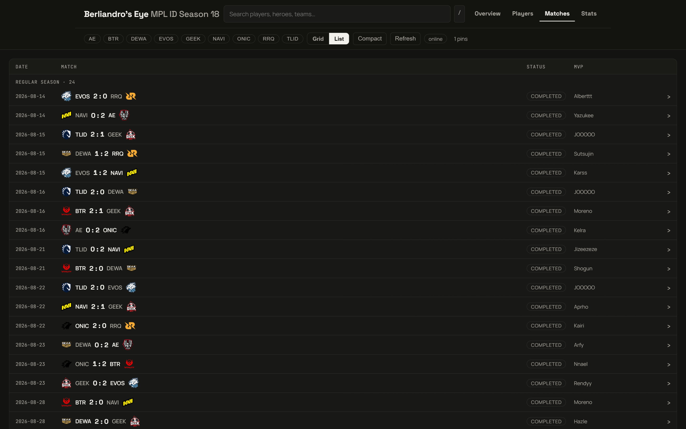
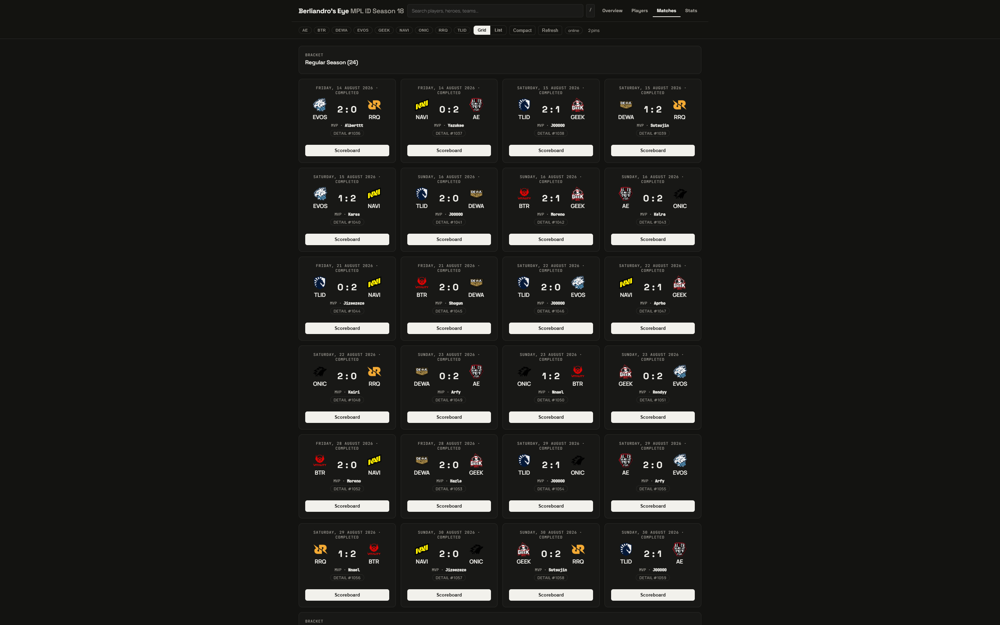
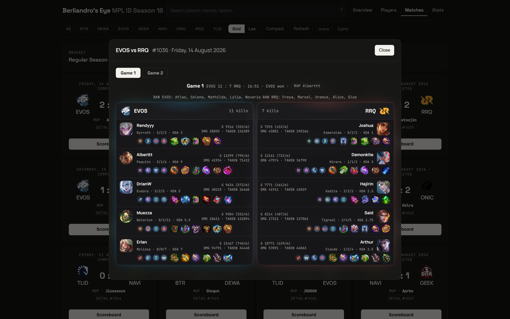
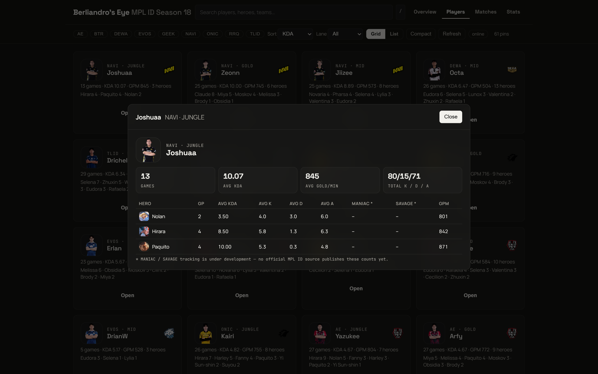

# Berliandro's Eye — MPL ID Season 18

A dark, minimalist, frosted-glass web app for exploring **MPL Indonesia Season 18**
(regular season + playoffs): player stats, match scoreboards, standings, and series MVPs.
Ships as a **single self-contained HTML file** (`mpl_id_s18_dark.html`) with all data
and hero/item artwork embedded — it works offline from the snapshot and refreshes
live from the mlbbhub API when online.

## Screenshots

### Overview — player deep dive (KDA trend, hero pool, win rates, items, game log)


### Players — sortable cards with hero pools


### Matches — full-width list layout with series MVP per match


### Matches — grid layout with series MVP per card


### Scoreboard — symmetrical 50/50 split, per-game MVP, first-pick glow


### Player card — per-hero AVG KDA / K / D / A, MANIAC, SAVAGE (🚧 under development)


## Features

- **Overview** — pick any player: tiles (games, avg KDA, game/match W-L + WR, avg game
  time, kill participation), KDA-trend chart, hero pool with win rates, side splits,
  top items, emblems & talents, record by opponent, series MVPs, full game log.
- **Players** — grid/list cards with photos, KDA, GPM, hero pools; filter by team,
  lane, search text; sort by KDA / games / kills.
- **Matches** — full-width frosted list (date, logos, score, status, series MVP) and
  grid cards (also showing series MVP). Completed cards open the scoreboard.
- **Scoreboard dialog** — symmetrical 50/50 team split with first-pick blue/red glow,
  centered header (score, duration, date), full-width bans bridge, mirrored player
  rows, and a **per-game MVP pill** next to “TEAM won”.
- **Player dialog** — per-hero table: GP, AVG KDA (`00.00`), AVG K, AVG D, AVG A,
  MANIAC, SAVAGE, GPM.
- **Stats** — standings, Top-KDA leaders, series MVP history.
- **Offline-first** — embedded snapshot renders instantly; Refresh re-fetches live
  data with retry/timeout, caches to `localStorage`, and reports how many brand-new
  heroes/items were served from the live CDN.

## Stat notes (how derived numbers work)

- **Game MVP**: the mlbbhub API exposes no per-game MVP (game `summary` is empty), so
  the app awards it to the **highest-KDA player on the winning team**
  (tiebreaks: kills, then gold). Series MVP comes from Liquipedia.
- **MANIAC / SAVAGE**: 🚧 **Under development** — no API endpoint (`/match`,
  `/stats/players`, `/stats/heroes`) or official MPL ID page publishes kill-streak
  data (the official leaderboard exists for MPL MY only), so these columns render
  `–` until a source exists. They are never fabricated.

## Project layout

| Path | What it is |
|---|---|
| `mpl_id_s18_dark.html` | Built app (generated — open this in a browser) |
| `tools/templates/` | Single source: `doc.html`, `style.css`, `app.js` |
| `tools/build_s18_db.py` | ETL: mlbbhub + Liquipedia → SQLite + `data/csv/` |
| `tools/gen_dark.py` | Build: CSV + assets → `mpl_id_s18_dark.html` |
| `tools/fetch_assets.py` | Download every referenced hero/item asset (`--check-only`, `--live`) |
| `tools/check.py` | Regression suite (incl. STRICT asset coverage + JS syntax gate) |
| `tools/check_parity.py` | Regen parity gate |
| `tools/shots.py` | README screenshots at 2880×1800 (Playwright + system Chrome) |
| `assets/` | Downloaded artwork + `manifest.json` |
| `data/` | SQLite DB, CSV exports, `lanes.json` |
| `github/assets/` | README screenshots |

## Commands

```bash
python tools/build_s18_db.py   # full ETL rebuild (network)
python tools/fetch_assets.py   # download missing hero/item assets
python tools/fetch_assets.py --live        # also cover season progress
python tools/fetch_assets.py --check-only  # audit only
python tools/gen_dark.py       # rebuild the HTML
python tools/check_parity.py   # regen parity gate
python tools/check.py          # regression suite (0 failures expected)
python tools/shots.py          # re-capture README screenshots
```

Serve locally (or just double-click the HTML):

```bash
python -m http.server 8931
# → http://localhost:8931/mpl_id_s18_dark.html
```

## Data sources

- Matches, games, per-player stats, drafts: `https://mpl.mlbbhub.com/api/v1/id`
- Series MVPs, schedule cross-check: Liquipedia (`MPL/Indonesia/Season 18`)
- Hero artwork: scoregg CDN, Liquipedia infoboxes (see `tools/fetch_assets.py`)
